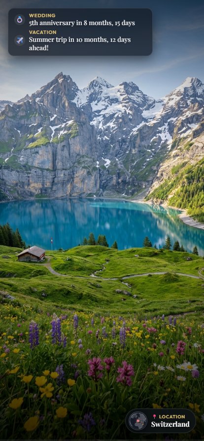

# 📸 Family Photo Gallery & Slideshow

A clean, minimalist photo gallery and digital photo frame application built with **Node.js** and **Express**. It cycles through your photo collection with a gentle Ken Burns pan-and-zoom effect and features a stylized overlay celebrating your family's most important milestones.

---

## 📱 Application Preview

### Standard PC LCD (16:9 Landscape)


### Mobile Device (Phone Portrait)
<p align="center">
  
</p>

---

## ✨ Features

- **Cinematic Ken Burns Slideshow**:
  - Automatically advances through photos with smooth crossfading transitions.
  - Applies gentle, randomized pan and zoom animations (`kb-zoom-in`, `kb-zoom-out`, `kb-pan-right`, `kb-pan-left`, `kb-zoom-pan-up`, `kb-zoom-pan-down`).
  - Pre-buffers incoming images to ensure seamless display without stutter.
  - Configurable slide duration (3 to 30 seconds).

- **Interactive Controls**:
  - **Click to Pause/Resume**: Clicking anywhere on the photo instantly pauses both the slide timer and the gentle zoom motion in place, showing a sleek status pill. Clicking again resumes playback.
  - **Discreet Navigation**: Minimalist frosted glass Previous (`‹`) and Next (`›`) buttons that automatically fade when idle.
  - **Keyboard Shortcuts**:
    - `Left Arrow`: Previous photo
    - `Right Arrow`: Next photo
    - `Spacebar`: Toggle pause / resume
    - `F`: Toggle full screen (ideal for digital picture frame mode)
  - **Fullscreen Button & Settings Gear**: Located discreetly in the top-right corner.

- **Customizable Milestone Overlay**:
  - **Dynamic Milestone Tracking**: Supports 3 flexible milestone types:
    - **Anniversary**: Celebrates annual anniversaries (e.g. `💍 5th anniversary in 8 months, 15 days`).
    - **Countdown**: Tracks time remaining until future events (e.g. `✈️ Summer trip in 10 months, 12 days ahead!`).
    - **Age**: Calculates elapsed time since an event or birthday with custom prefix/postfix phrases (e.g. `🎂 2 years, 3 months old`).
  - **Auto-Rotation**: Cycles through configured milestones automatically.
  - Backed by subtle gradient scrims and frosted glass cards for legibility over any photo.

- **Admin Management Dashboard (`/admin`)**:
  - **Customizable Milestone Manager**: Add, edit, reorder, or toggle any milestone with custom emojis, titles, dates, types, and phrases with instant live preview.
  - **Slideshow & Effect Controls**: Customize slide duration, Ken Burns effects, and background music playback.
  - **Drag-and-Drop Photo Upload**: Supports multiple image uploads (JPG, PNG, WEBP, GIF, AVIF) with real-time upload progress.
  - **Gallery Management & Multi-Select**: View all uploaded photos with position badges (`#1`, `#2`, ...), drag-and-drop cards to reorder slides, select multiple photos (or "Select All") to batch delete photos in one click, and preview full size in a modal lightbox.

---

## 🚀 Getting Started

### 1. Launch the Server

You can launch the app by double-clicking `start.bat` or running:

```bash
npm start
```

The server will start on port `3000`.

### 2. Open the App in Your Browser

- **Main Slideshow**: [http://localhost:3000](http://localhost:3000)
- **Admin Dashboard**: [http://localhost:3000/admin](http://localhost:3000/admin)

---

## 📁 Project Structure

```
PhotoGallery/
├── server.js               # Express server with REST API & Multer upload handling
├── package.json            # Node.js configuration and dependencies
├── start.bat               # One-click Windows launcher
├── data/
│   ├── config.json         # Persisted milestone dates & slideshow settings
│   └── photos.json         # Persisted photo catalog & ordering
└── public/
    ├── index.html          # Main Slideshow web application
    ├── admin.html          # Admin management dashboard
    ├── css/
    │   ├── slideshow.css   # Ken Burns animations & glassmorphism styling
    │   └── admin.css       # Clean dashboard styles & dropzone
    ├── js/
    │   ├── slideshow.js    # Slideshow engine, date calculations, pause logic
    │   └── admin.js        # Admin controller, live preview, multi-upload
---

## 🐳 Docker Deployment

### Run with Docker Compose

1. Clone or download this repository.
2. Launch the container using `docker compose`:

```bash
docker compose up -d
```

3. Open your browser:
   - **Slideshow**: `http://localhost:3000`
   - **Admin**: `http://localhost:3000/admin`

### Persistent Volumes

The container mounts three local directories to maintain your data across restarts:
- `./data` -> `/app/data` (settings & photo metadata)
- `./uploads` -> `/app/public/uploads` (uploaded image files)
- `./audio` -> `/app/public/audio` (background music tracks)

### Automated Publishing to Docker Hub (GitHub Actions)

This repository includes a GitHub Actions workflow (`.github/workflows/docker-publish.yml`) that automatically builds and pushes multi-architecture images (`linux/amd64` and `linux/arm64`) to Docker Hub.

1. Create a Personal Access Token on [Docker Hub](https://hub.docker.com/) (**Account Settings** > **Security** > **New Access Token**).
2. In your GitHub repository, navigate to **Settings** > **Secrets and variables** > **Actions** and add:
   - `DOCKERHUB_USERNAME`: Your Docker Hub username
   - `DOCKERHUB_TOKEN`: The Docker Hub access token
3. Push commits to `main` to publish `:latest`, or create a release tag (e.g. `git tag v1.0.0 && git push origin v1.0.0`) to publish versioned tags.

